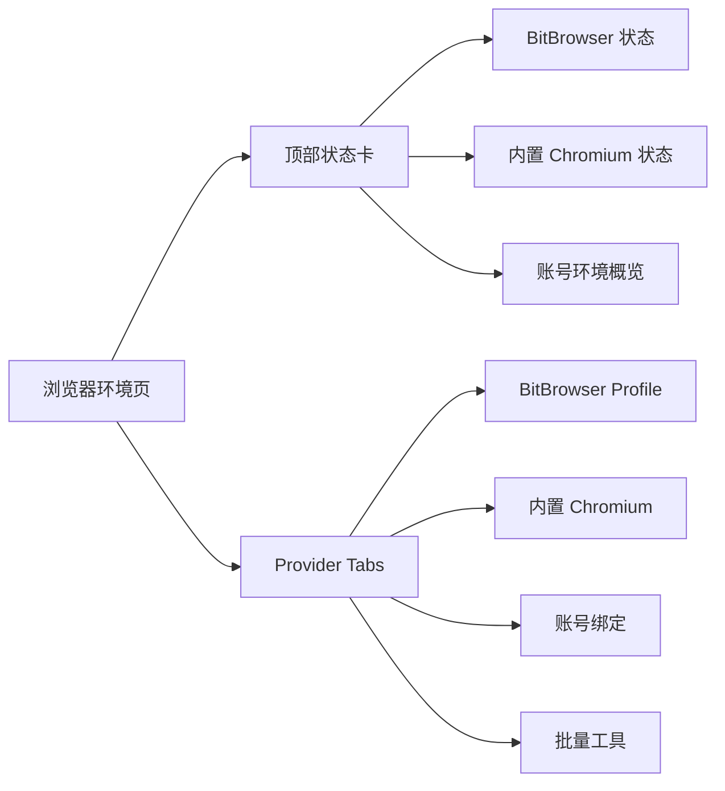
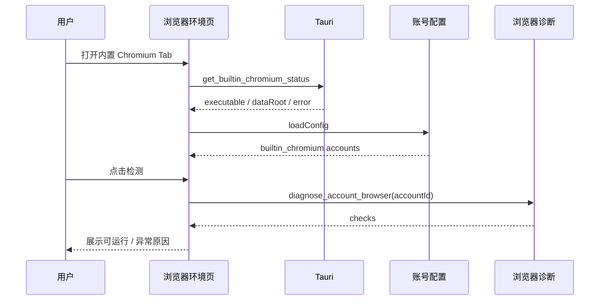

# 浏览器环境双 Provider 页面 V1 Design

## 总体设计

【浏览器环境】页面从“BitBrowser profile 管理页”升级为“浏览器环境控制台”。页面仍跟随当前平台上下文，但内部按 provider 分区。



## 页面标题

标题：

```text
<平台> / 浏览器环境
```

副标题：

```text
管理 BitBrowser 与内置 Chromium 浏览器环境、账号绑定、代理检测和运行状态。
```

## 顶部状态卡设计

### BitBrowser 状态卡

字段：

```text
标题：BitBrowser
主状态：在线 / 离线 / 待检测
副信息：Local API 地址
指标：Profile 总数、已打开窗口
操作：刷新、打开系统设置
```

状态规则：

- API 可用：绿色 `在线`。
- API 不可用：红色 `不可用`，展示错误摘要。
- 未检测：灰色 `待检测`。

### 内置 Chromium 状态卡

字段：

```text
标题：内置 Chromium
主状态：可用 / 未检测到 / 待检测
副信息：可执行文件名称或路径摘要
指标：内置 Chromium 账号数、运行记录数
操作：自动检测、打开系统设置
```

状态规则：

- 检测到可执行文件：绿色 `可用`。
- 未检测到：金色 `未检测到`。
- 检测失败：红色 `异常`。

未检测到文案：

```text
未检测到可用 Chromium，请安装 Chrome/Edge 或手动指定可执行文件。
```

### 账号环境状态卡

字段：

```text
标题：账号环境
BitBrowser 账号：N
内置 Chromium 账号：N
待处理：未绑定 profile / 缺少可执行文件 / 代理异常
```

## Tab 设计

### Tab 1：BitBrowser Profile

保留现有 Profile 列表。

表格列：

```text
窗口名称
窗口 ID
平台
状态
绑定账号
代理
分组
操作
```

操作：

- 打开 profile。
- 关闭 profile。
- 复制窗口 ID。
- 绑定账号。

空态：

```text
暂无 BitBrowser Profile。可通过单个创建或批量工具创建 profile。
```

### Tab 2：内置 Chromium

展示本机 Chromium 能力和账号级 user data dir。

顶部信息：

```text
Chromium 可执行文件：<path 或 未检测到>
数据根目录：<data_dir>/browser/builtin_chromium
状态：生产可选，不等价替代 BitBrowser 指纹环境能力
```

表格列：

```text
账号
状态
代理
User Data Dir
Runtime 记录
最近 CDP
最近运行
操作
```

状态定义：

- `可运行`：Chromium 可执行文件可用，user data dir 可读写。
- `未检测到 Chromium`：系统未找到 Chrome / Edge / Chromium。
- `目录异常`：user data dir 不可读写。
- `运行中`：runtime.json 存在且 PID 存活。
- `未运行`：无运行记录或 PID 已退出。

操作：

- `检测`：调用账号级浏览器诊断。
- `打开`：启动该账号内置 Chromium 环境。
- `复制路径`：复制 user data dir。
- `清理数据`：删除该账号 user data dir，需要二次确认。

清理确认文案：

```text
只会删除该账号在 Account Matrix 内置 Chromium 下的本地用户数据，不会删除 BitBrowser profile。
```

### Tab 3：账号绑定

统一展示账号与浏览器环境关系。

表格列：

```text
账号
平台
浏览器提供方
环境标识
登录邮箱
代理
状态
操作
```

环境标识规则：

```text
bitbrowser        -> profile_id
builtin_chromium  -> user-data-dir
```

操作规则：

- BitBrowser：绑定 profile、打开 profile、复制 profile_id。
- 内置 Chromium：检测环境、复制 user data dir、清理数据。

### Tab 4：批量工具

将现有创建和同步工具集中到批量工具。

分区：

```text
BitBrowser 单个创建
BitBrowser 批量创建
账号环境同步
```

账号环境同步规则：

- BitBrowser 账号：补齐或修正 profile 绑定。
- 内置 Chromium 账号：补齐 `browser_provider: builtin_chromium`、检查 user data dir、检查 Chromium 可执行文件。
- 不把内置 Chromium 账号同步为 BitBrowser profile。

## 数据来源

页面需要组合以下数据：

```text
BitBrowser API 状态
BitBrowser Profile 列表
账号配置 accounts.yaml
内置 Chromium 状态 get_builtin_chromium_status
账号级浏览器诊断 diagnose_account_browser
内置 Chromium runtime.json
执行记录最近运行状态 actions.db
```

## 交互流程

### 用户选择内置 Chromium 账号后的查看流程



### 用户从 BitBrowser 切到内置 Chromium 的认知路径

1. 顶部看到 BitBrowser 与内置 Chromium 两张状态卡。
2. 在账号绑定 Tab 看到每个账号当前 provider。
3. 选择内置 Chromium 账号时看到 user data dir，不再看到 profile 创建要求。
4. 若 Chromium 未检测到，页面引导自动检测或去系统设置指定路径。

## 空态设计

BitBrowser Profile 空态：

```text
暂无 BitBrowser Profile。可通过批量工具创建并绑定账号。
```

内置 Chromium 空态：

```text
暂无内置 Chromium 账号。可在账号管理中将浏览器提供方设为内置 Chromium。
```

账号绑定空态：

```text
暂无账号。请先在账号管理中新增账号。
```

## 错误提示

Chromium 未检测到：

```text
未检测到可用 Chromium，请安装 Chrome/Edge 或手动指定可执行文件。
```

BitBrowser API 不可用：

```text
BitBrowser API 不可用，请确认 BitBrowser 已启动并开启 Local API。
```

内置 Chromium 清理失败：

```text
清理失败，请检查目录权限或关闭正在运行的 Chromium。
```

## 视觉与布局

- 顶部状态卡使用三列布局；窄屏降为单列。
- BitBrowser 与内置 Chromium 使用 Tag 区分 provider。
- 生产默认使用绿色 Tag。
- 生产可选使用金色或蓝色 Tag。
- 路径默认截断展示，提供复制按钮；不在紧凑表格中展示超长完整路径。
- 操作按钮使用图标加文本，危险操作使用红色按钮并二次确认。

## 兼容策略

- 原 Profile 列表功能迁移到 `BitBrowser Profile` Tab，不删除能力。
- 原单个创建和批量创建迁移到 `批量工具`，并明确标注 BitBrowser。
- 原账号同步迁移到 `账号绑定` 或 `批量工具` 中的账号环境同步。
- 旧账号缺少 `browser_provider` 时，在 UI 中按 BitBrowser 显示。

## 验证重点

- BitBrowser API 在线时，原 profile 列表正常显示。
- BitBrowser API 离线时，内置 Chromium Tab 仍可查看。
- 选择内置 Chromium 时，不要求用户创建 BitBrowser profile。
- 内置 Chromium 未检测到可执行文件时，提示明确且有下一步。
- 混合账号列表中，BitBrowser 和内置 Chromium 的操作不串。
