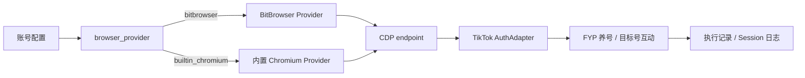
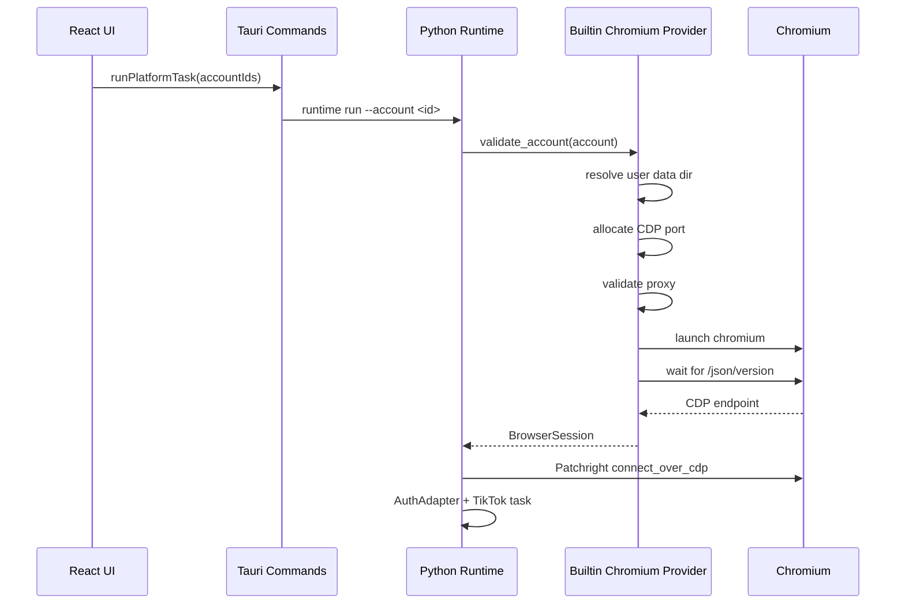

# 内置 Chromium 生产可选方案 V1 Design

## 总体设计

内置 Chromium 不重写 TikTok 任务逻辑，只替换浏览器获取方式：

```text
任务选择账号 -> 账号决定 provider -> provider 返回 CDP endpoint -> TikTok 任务复用现有动作逻辑
```



## Provider 状态模型

```text
provider: bitbrowser | builtin_chromium
label: string
status: production_default | production_optional | experimental
production_ready: boolean
risk_level: stable | experimental
supports_tiktok: boolean
requires_external_app: boolean
supports_proxy: boolean
supports_persistent_login: boolean
supports_close: boolean
supports_account_isolation: boolean
notes: string
```

验收前：

```text
bitbrowser          production_default
builtin_chromium    experimental
```

验收后：

```text
bitbrowser          production_default
builtin_chromium    production_optional
```

## 配置模型

### BitBrowser

```yaml
accounts:
  - id: tiktok_1001
    platform: tiktok
    enabled: true
    browser_provider: bitbrowser
    bitbrowser_profile_id: "xxxx"
    browser:
      provider: bitbrowser
      profile_id: "xxxx"
```

### 内置 Chromium

```yaml
accounts:
  - id: tiktok_1002
    platform: tiktok
    enabled: true
    browser_provider: builtin_chromium
    browser:
      provider: builtin_chromium
      proxy_type: socks5
      proxy: "127.0.0.1:7890"
      user_data_dir: ""
```

兼容规则：

- 缺少 `browser_provider` 的旧账号视为 BitBrowser。
- 有 `bitbrowser_profile_id` 但没有 `browser.profile_id` 的旧账号继续可运行。
- 内置 Chromium 的空 `user_data_dir` 使用默认账号独立目录。

## 内置 Chromium 数据目录

默认目录：

```text
<data_dir>/browser/builtin_chromium/<account_id>/
  user-data/
  downloads/
  logs/
  runtime.json
```

`runtime.json` 记录：

```json
{
  "accountId": "tiktok_1002",
  "provider": "builtin_chromium",
  "lastPid": 1234,
  "lastPort": 45123,
  "lastCdpEndpoint": "http://127.0.0.1:45123",
  "lastStartedAt": "2026-07-28T12:00:00"
}
```

## 启动流程



## CDP 端口策略

- 默认随机分配可用本地端口。
- 启动前探测端口是否可绑定。
- 启动后轮询 `http://127.0.0.1:<port>/json/version`。
- 连接失败日志包含 account_id、provider、port、executable、user data dir 和代理摘要。

## 代理设计

账号级代理字段：

```text
browser.proxy_type: http | https | socks5
browser.proxy: host:port 或 host:port:username:password
```

启动参数：

```text
--proxy-server=<scheme>://<host>:<port>
```

日志规则：

- 允许记录代理 host 和 port。
- 不记录代理密码。
- 有 username/password 时展示为 `username:***@host:port`。

## 关闭规则

关闭只针对应用启动并记录的内置 Chromium 进程：

- PID 必须来自当前账号的运行记录。
- PID 不存在时返回可理解结果。
- 不关闭 BitBrowser 中用户手动打开且非本次任务启动的 profile，仍沿用现有 provider 规则。

## 任务集成

TikTok runner 只依赖：

```text
BrowserSession.cdp_endpoint
BrowserSession.provider
BrowserSession.process_id
BrowserSession.user_data_dir
```

运行前检查：

- 账号启用。
- provider 支持当前平台和任务。
- 内置 Chromium 配置合法。
- 自动登录开启时存在 username 和本机密码凭据。

## UI

- 账号管理显示浏览器提供方、BitBrowser profile_id、内置 Chromium user data dir、代理配置和清理入口。
- 养号任务和目标号互动显示执行账号、登录邮箱、登录状态和浏览器 provider。
- 启动确认框显示本次运行账号清单和浏览器环境。
- 系统设置能力矩阵只展示 BitBrowser 与内置 Chromium。

## 诊断

按账号诊断：

1. 配置校验。
2. 代理格式与连通性。
3. Chromium executable。
4. user data dir 读写权限。
5. CDP 端口分配。
6. 浏览器启动。
7. CDP endpoint。
8. TikTok 登录状态。

## 发布策略

第一阶段：

- 保持 UI 标记“实验”。
- 完成专项验收文档。
- 修复验收中发现的问题。

第二阶段：

- provider capability 改为 `production_optional`。
- UI 移除“实验”标记。
- 设置页仍显示 BitBrowser 为默认推荐。
- 发布说明写明内置 Chromium 是生产可选，不等价替代 BitBrowser 指纹能力。
