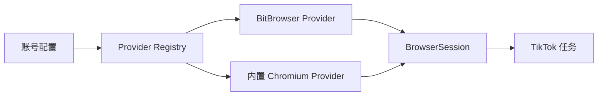

# Multi Browser Adapter V1 Design

## 总体设计

浏览器环境由账号配置决定，任务只消费 provider 返回的 `BrowserSession`：

```text
账号配置 -> BrowserProvider -> BrowserSession(CDP endpoint) -> TikTok AuthAdapter/任务脚本
```



## Provider 接口

```python
class BrowserProvider:
    name: str
    capability: BrowserProviderCapability

    def status(config): ...
    def validate_account(account, config): ...
    def is_open(account, config): ...
    def start_session(account, config) -> BrowserSession: ...
    def close_session(session, config): ...
```

`BrowserSession`：

```text
provider: bitbrowser | builtin_chromium
account_id: string
profile_id: string | null
cdp_endpoint: string
already_open: boolean
process_id: int | null
user_data_dir: string | null
```

## 配置模型

### BitBrowser 账号

```yaml
accounts:
  - id: tiktok_1001
    platform: tiktok
    enabled: true
    bitbrowser_profile_id: "xxxx"
    browser_provider: bitbrowser
    browser:
      provider: bitbrowser
      profile_id: "xxxx"
```

### 内置 Chromium 账号

```yaml
accounts:
  - id: tiktok_1002
    platform: tiktok
    enabled: true
    browser_provider: builtin_chromium
    browser:
      provider: builtin_chromium
      user_data_dir: ""
      proxy_type: socks5
      proxy: "127.0.0.1:7890"
```

兼容规则：

- 缺少 `browser_provider` 时按 BitBrowser。
- 旧 `bitbrowser_profile_id` 继续有效。
- 内置 Chromium 的空 `user_data_dir` 使用默认账号独立目录。

## BitBrowser Provider

- 通过 BitBrowser Local API 打开 profile。
- 使用返回的 CDP endpoint 连接任务。
- 关闭沿用现有 BitBrowser profile 关闭逻辑。
- API 不可用时错误指向 Local API 地址。

## 内置 Chromium Provider

- 从系统设置或账号配置解析 Chromium executable。
- 为每个账号创建独立 user data dir。
- 随机分配本地调试端口。
- 支持基础 `http`、`https`、`socks5` 代理参数。
- 启动后轮询 `/json/version` 确认 CDP endpoint 可用。
- 任务结束时只关闭本次由应用启动并记录的进程。

## UI

- 账号管理只提供 BitBrowser 和内置 Chromium 两个选项。
- 系统设置能力矩阵只显示两个 provider。
- 养号任务、目标号互动的执行账号区域显示当前账号浏览器环境。
- 启动确认框显示账号、平台、登录配置摘要和浏览器环境。

## 诊断

诊断入口按账号执行：

- BitBrowser：检查 profile 绑定、Local API、profile 状态。
- 内置 Chromium：检查 executable、user data dir、代理配置、启动和 CDP endpoint。

## 安全

- 登录密码只通过本机安全凭据存储和临时环境变量传递。
- 日志、配置、备份和命令行不输出密码。
- 代理密码在 UI 和日志中脱敏。
