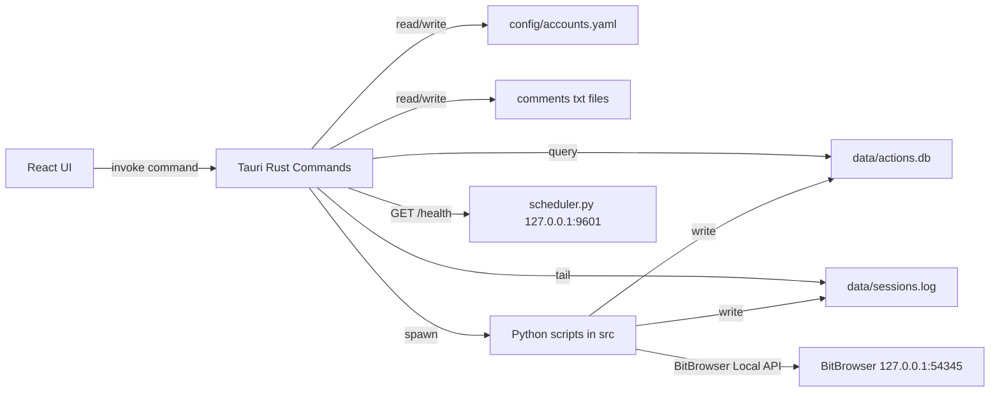

# PC 端养号产品 V1 Design

## 总体方案

V1 采用“桌面壳 + 可视化前端 + 本地后端命令 + Python sidecar”的架构。

技术栈：

- 桌面壳：Tauri
- 前端：React + TypeScript + Vite
- UI：Ant Design
- 图标：lucide-react
- 本地后端：Tauri Rust Commands
- 执行核心：现有 Python 脚本
- 数据：YAML、txt、SQLite、sessions.log
- 浏览器控制：BitBrowser Local API + Patchright CDP

设计原则：

- 保留 `src/` Python 脚本命令行入口。
- `config/accounts.yaml` 仍是 V1 真实配置源。
- UI 命令参数必须结构化传给后端，后端使用进程 API 按参数数组启动 Python，避免 shell 拼接。
- V1 同一时间只允许运行一个养号执行进程。
- 平台扩展要有结构，但只允许 TikTok 启动真实任务。

## 目录结构

```text
account-matrix/
  desktop/
    specs/
      pc-end-product-v1/
        requirements.md
        design.md
        tasks.md
    src/
      app/
        App.tsx
        routes.tsx
      components/
        AppShell.tsx
        PageHeader.tsx
        StatusTag.tsx
        LogViewer.tsx
        ConfirmDanger.tsx
      pages/
        HomePage.tsx
        PlatformPage.tsx
        AccountPage.tsx
        BrowserProfilePage.tsx
        TaskPage.tsx
        TargetEngagementPage.tsx
        SchedulerPage.tsx
        CommentPoolPage.tsx
        ExecutionRecordPage.tsx
        StatsPage.tsx
        GmailSetupPage.tsx
        DiagnosticPage.tsx
        SettingsPage.tsx
      services/
        api.ts
        types.ts
      styles/
        globals.css
    src-tauri/
      src/
        main.rs
        state.rs
        paths.rs
        commands/
          mod.rs
          bitbrowser.rs
          config.rs
          files.rs
          logs.rs
          process.rs
          scheduler.rs
          stats.rs
  config/
  src/
  data/
  requirements.txt
```

## 运行时架构



## 路径策略

开发期默认：

```text
project_root = desktop/..
config_path = project_root/config/accounts.yaml
comments_path = project_root/config/comments.txt
brand_comments_path = project_root/config/comments_brand.txt
data_dir = project_root/data
actions_db_path = project_root/data/actions.db
sessions_log_path = project_root/data/sessions.log
lock_file_path = project_root/data/run.lock
src_dir = project_root/src
```

打包期支持在系统设置里覆盖：

- 项目根目录
- Python 可执行文件路径
- 配置文件路径
- 数据目录
- 评论池路径
- BitBrowser API 地址

## 前端页面设计

### 首页

展示：

- TikTok 启用账号数
- BitBrowser API 状态
- 今日计划任务数
- 今日完成账号数
- 今日失败账号数
- 今日目标互动数

快捷操作：

- 运行全部启用账号
- 运行指定账号
- 启动调度服务
- 查看今日排期
- 同步账号配置
- 编辑评论池

### 平台管理

V1 内置平台：

| 平台 | 状态 | 自动执行 |
| --- | --- | --- |
| TikTok | 已支持 | 允许 |
| Instagram | 预留 | 禁止 |
| WhatsApp | 预留 | 禁止 |
| 抖音 | 预留 | 禁止 |

平台页用于展示能力矩阵，不作为 V1 自动执行入口。

### 账号管理

主表格字段：

- 账号 ID
- 平台
- 启用状态
- IP 分组
- 运行班次
- BitBrowser profile_id
- profile 状态
- 最近执行时间
- 最近结果
- 备注
- 操作

编辑使用抽屉或弹窗。保存前调用后端配置校验，保存成功前自动备份 `accounts.yaml`。

### 浏览器环境

分区：

- BitBrowser API 状态
- profile 列表
- 单个创建 profile
- 批量创建 profile
- 从 BitBrowser 同步账号配置

密码、代理密码默认隐藏，日志展示前统一脱敏。

### 养号任务

V1 可执行任务：

- TikTok FYP 养号
- TikTok 目标号互动

任务配置写入 `accounts.yaml` 对应字段：

- `defaults.daily_actions.fyp_browse_minutes`
- `defaults.daily_actions.like_probability`
- `defaults.daily_actions.follows_per_session`
- `defaults.daily_actions.comment.enabled`
- `defaults.daily_actions.comment.comments_per_session`
- `defaults.daily_actions.comment.min_video_comments`
- `defaults.daily_actions.comment.probability`

启动任务前展示确认弹窗，列出任务类型、账号数量、预计行为和风险提示。

### 目标号互动

配置写入 `target_accounts`：

- enabled
- handles
- participants
- first_run_latest_n
- max_videos_per_run
- like_probability
- comment_probability
- comments_file
- follow
- follow_probability

水位线从 `target_engagements` 查询，不单独维护另一份状态。

### 调度计划

包装 `scheduler.py`：

- 启动调度服务
- 停止调度服务
- 获取 `/health`
- 展示 jobs、next_run、lock_held_externally
- 展示 BitBrowser API 状态和 run.lock 状态

UI 明确说明 V1 调度使用运行机器本地时间。

### 评论素材

读取和保存：

- `config/comments.txt`
- `config/comments_brand.txt`

V1 可先使用双栏文本编辑器，保存时保持每行一条评论的格式。

### 执行记录与统计

直接读取 `data/actions.db`：

- `action_log`
- `target_engagements`
- `target_follows`

统计逻辑与 `src/stats.py` 保持一致，优先在 Rust 后端直接查询 SQLite，减少解析 stdout。

### Gmail 初始化

单账号和批量模式均通过 `gmail_setup.py` 执行。

密码传递优先使用：

- `--password-env`
- `--new-password-env`

前端和后端日志都要脱敏。

### 诊断工具

点赞诊断：

```text
python src/test_like.py --account <account_id>
```

评论诊断：

```text
python src/test_comment.py --account <account_id> --min <n> --max-scroll <n>
python src/test_comment.py --account <account_id> --min <n> --max-scroll <n> --no-post
```

## 后端 Command 设计

### Config

```text
get_project_paths() -> ProjectPaths
load_config() -> ConfigSnapshot
validate_config(payload) -> ValidationResult
save_config(payload) -> SaveResult
backup_config() -> BackupResult
```

保存策略：

1. 校验配置。
2. 生成备份：`config/backups/accounts.YYYYMMDD-HHMMSS.yaml`。
3. 写回 `config/accounts.yaml`。
4. 返回保存结果和备份路径。

### BitBrowser

```text
check_bitbrowser_api() -> ApiStatus
list_browser_profiles() -> BrowserProfile[]
get_profile_status(profile_id) -> ProfileStatus
open_profile(profile_id) -> ProfileOperationResult
close_profile(profile_id) -> ProfileOperationResult
create_single_browser_profile(payload) -> CreateProfileResult
create_batch_browser_profiles(payload) -> BatchCreateProfileResult
sync_accounts_dry_run(payload) -> SyncPreview
sync_accounts_apply(payload) -> SyncApplyResult
```

V1 可以先包装现有 Python 脚本或复用现有 API 逻辑，后续再抽公共 Python API。

### Process

```text
run_all_accounts() -> ProcessStartResult
run_one_account(account_id) -> ProcessStartResult
run_selected_accounts(account_ids) -> ProcessStartResult
get_current_run_status() -> ProcessStatus
stop_current_run(force) -> StopResult
```

状态模型：

```text
idle
starting
running
pause_pending
completed
partial_failed
failed
stopped
```

单实例约束：

- Rust 后端维护当前进程状态。
- 启动前检查 `data/run.lock`。
- 检查活跃 PID 后阻止重复启动。
- 陈旧 lock 只提示用户清理，不自动删除。

### Scheduler

```text
start_scheduler() -> ProcessStartResult
stop_scheduler() -> StopResult
get_scheduler_process_status() -> SchedulerProcessStatus
get_scheduler_health() -> SchedulerHealth
```

### Logs

```text
tail_session_log(offset) -> LogChunk
get_stdout_chunk(process_id, offset) -> LogChunk
get_stderr_chunk(process_id, offset) -> LogChunk
```

所有日志返回前先脱敏。

### Stats

```text
query_action_logs(filter) -> ActionLog[]
query_target_engagements(filter) -> TargetEngagementRecord[]
query_target_follows(filter) -> TargetFollowRecord[]
query_fyp_stats(scope) -> FypStatsSummary
query_target_stats(scope) -> TargetStatsSummary
```

## 核心数据类型

```ts
export type PlatformId = 'tiktok' | 'instagram' | 'whatsapp' | 'douyin'

export interface Account {
  id: string
  platform: PlatformId
  enabled: boolean
  ipGroup?: number
  activeHours: [number, number][]
  bitbrowserProfileId?: string
  notes?: string
  profileOpen?: boolean
  lastRunAt?: string
  lastStatus?: 'ok' | 'error' | 'skip' | 'unknown'
}

export interface FypSettings {
  fypBrowseMinutes: [number, number]
  likeProbability: number
  followsPerSession: [number, number]
  comment: {
    enabled: boolean
    commentsPerSession: [number, number]
    minVideoComments: number
    probability: number
  }
}

export interface TargetEngagementSettings {
  enabled: boolean
  handles: string[]
  participants: string[]
  firstRunLatestN: number
  maxVideosPerRun: number
  likeProbability: number
  commentProbability: number
  commentsFile: string
  follow: boolean
  followProbability: number
}

export interface SchedulerHealth {
  status: 'stopped' | 'starting' | 'running' | 'error'
  jobs: SchedulerJob[]
  nextRun?: string
  lockHeldExternally?: boolean
  error?: string
}

export interface ProcessStatus {
  status: 'idle' | 'starting' | 'running' | 'pause_pending' | 'completed' | 'partial_failed' | 'failed' | 'stopped'
  processId?: number
  taskType?: string
  accountId?: string
  startedAt?: string
  endedAt?: string
  error?: string
}
```

## 配置校验设计

校验项：

- 账号 ID 唯一。
- profile_id 唯一。
- active_hours 合法。
- 同 ip_group 启用账号时间不重叠。
- target participants 都存在。
- handles 只包含合法 TikTok handle。
- 概率字段范围为 0-1。
- 数量范围左值小于等于右值。
- BitBrowser API URL 合法。

同 IP 班次重叠判断：

```text
按 ip_group 分组
只检查 enabled=true 的账号
展开每个账号的 active_hours
任意两个区间满足 a.start < b.end 且 b.start < a.end 即为重叠
```

## 进程执行设计

Python 启动规则：

- cwd 使用项目根目录。
- 命令形态使用 `python src/<script>.py ...`。
- 参数通过数组传入。
- 密码类参数不进入 argv，使用环境变量。
- stdout、stderr 分别缓存并可增量读取。

任务启动前置检查：

1. Python 可执行文件可用。
2. `config/accounts.yaml` 可读。
3. 账号存在且启用策略满足本次启动。
4. 账号配置了 `bitbrowser_profile_id`。
5. BitBrowser API 可用。
6. `data/run.lock` 不存在活跃 PID。
7. 当前 Tauri 后端没有正在运行的养号进程。

停止语义：

- 暂停后续：V1 可先只用于桌面端多账号队列，当前账号跑完后不启动下一个。
- 强制停止：终止当前 Python 进程，二次确认，并提示日志可能不完整。
- 停止调度：停止 scheduler 进程，不保证已触发账号任务立即停止。

## 安全与脱敏

敏感字段：

- 代理密码
- Google 当前密码
- Google 新密码
- Webhook URL 中的 secret
- ServerChan sendkey
- Bark key

脱敏规则：

- UI 默认不明文显示。
- 日志展示前替换为 `***`。
- 导出记录默认不包含密码。
- 批量邮箱文件只保留本地路径，不上传。

危险操作：

- 强制停止任务
- 清理 run.lock
- 重置目标号水位线
- 删除账号
- 清理日志

这些操作必须弹出二次确认。

## 异常处理

异常分类：

- BitBrowser API 不可用
- profile 已打开
- profile 打开失败
- 未返回 CDP 地址
- 配置缺失或格式错误
- run.lock 活跃
- TikTok 页面元素定位失败
- 目标号抓取失败
- SQLite 文件不存在或查询失败
- Gmail 登录挑战
- 调度服务未启动

错误展示要求：

- 指出账号 ID、profile_id、脚本名称、配置路径或 API URL。
- 对可恢复错误提供下一步操作。
- 对脚本内部错误保留 stderr 入口。

## 测试策略

单元级：

- YAML 读取和保存。
- 配置校验。
- active_hours 重叠检测。
- 评论池读取和保存。
- SQLite 查询。
- 进程参数构造。
- 日志脱敏。

集成级：

- 启动桌面端并读取 20 个账号。
- 检测 BitBrowser API。
- 运行单账号。
- 实时读取 sessions.log。
- 查询 action_log 和统计。
- 启动 scheduler 并读取 `/health`。
- 执行账号同步 dry-run。
- 执行点赞和评论诊断。

人工验收：

- 逐项覆盖 `requirements.md` 中的功能需求和完成定义。
