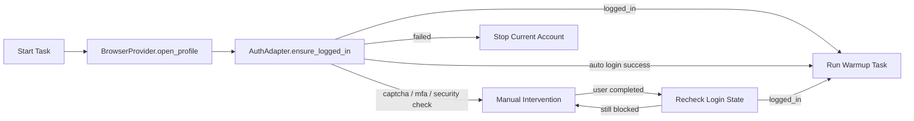

# 平台自动登录 V1 Design

## 总体方案

自动登录能力拆成三层：

```text
Account Management UI
  登录账号维护
  密码录入/更新
  登录状态诊断

Credential Store
  Windows Credential Manager / DPAPI
  只保存密码和敏感凭据

Runtime AuthAdapter
  登录状态检测
  自动填写账号密码
  人工接管判断
  登录成功后继续任务
```

任务执行链路：



## 配置模型

### accounts.yaml

`accounts.yaml` 只保存非敏感登录配置和凭据引用。

```yaml
accounts:
  - id: tiktok_1
    platform: tiktok
    enabled: true
    bitbrowser_profile_id: "xxxx"
    login:
      enabled: true
      method: password
      username: "user@example.com"
      credential_ref: "account-matrix:tiktok:tiktok_1:password"
      last_state: logged_in
      last_checked_at: "2026-07-27T12:00:00+08:00"
```

字段说明：

- `login.enabled`：是否启用自动登录。
- `login.method`：登录方式，V1 先支持 `password`。
- `login.username`：邮箱、用户名或手机号。
- `login.credential_ref`：凭据存储引用，不是密码。
- `login.last_state`：最近登录状态，可选缓存字段。
- `login.last_checked_at`：最近检测时间，可选缓存字段。

兼容规则：

- 缺少 `login` 时视为 `login.enabled=false`。
- `login.enabled=true` 时必须有 `username` 和可读取的 `credential_ref`。
- 配置备份只包含 `credential_ref`，不包含密码。

## 凭据存储设计

### 推荐方案

Windows 平台优先使用 Windows Credential Manager。

凭据 key：

```text
account-matrix:<platform>:<account_id>:password
```

保存内容：

```text
username: platform login username
secret: password
```

后备方案：

- 如果 Credential Manager 接入成本过高，使用 DPAPI 加密文件。
- 加密文件放在 `%APPDATA%/Account Matrix/credentials/`。
- 文件只能保存密文和 metadata。
- 开发模式可以允许环境变量注入，但生产 UI 不使用该方案。

### Tauri 命令

建议新增：

```text
save_account_credential(account_id, platform, username, password)
delete_account_credential(account_id, platform)
has_account_credential(account_id, platform)
test_account_credential(account_id, platform)
```

安全要求：

- 密码只从前端传到 Tauri 保存接口。
- 保存成功后前端立即清空密码输入状态。
- 后端日志不输出密码。
- 命令错误不包含密码。

## Runtime 凭据传递

生产任务启动时，不通过命令行参数传密码。

推荐流程：

1. Tauri 根据账号读取 Credential Manager。
2. Tauri 启动 runtime 时用临时环境变量传递密码。
3. runtime 读取环境变量并立即在内存中使用。
4. runtime 不打印该值。

环境变量建议：

```text
AM_LOGIN_USERNAME
AM_LOGIN_PASSWORD
AM_LOGIN_CREDENTIAL_REF
```

如果一次任务队列包含多个账号：

- 每个账号单独启动 runtime 子进程时，只注入该账号的密码。
- 如果 runtime 内部连续跑多个账号，建议改为 runtime 通过安全凭据 API 自取，或由 Tauri 按账号分段启动，避免一次性注入多个密码。

## AuthAdapter 设计

建议模块结构：

```text
runtime/account_matrix_runtime/auth/
  base.py
  registry.py
  tiktok.py
```

接口语义：

```text
detect_login_state(page, account) -> LoginState
open_login_page(page, account) -> None
fill_credentials(page, account, credential) -> None
submit_login(page, account) -> None
detect_intervention_required(page, account) -> InterventionState
wait_until_logged_in(page, account, timeout_seconds) -> LoginState
ensure_logged_in(page, account, credential) -> AuthResult
```

状态枚举：

```text
logged_in
logged_out
login_page
mfa_required
captcha_required
security_check_required
terms_required
unknown
failed
```

结果结构：

```text
AuthResult
  status: logged_in | auto_login_success | intervention_required | failed | skipped
  login_state: LoginState
  intervention_type: string | null
  message: string
```

## TikTok AuthAdapter

V1 TikTok adapter 职责：

- 打开 TikTok 首页或登录页。
- 判断当前是否已登录。
- 判断是否在登录页。
- 定位账号输入框。
- 定位密码输入框。
- 输入账号和密码。
- 提交登录。
- 检测验证码、二次验证、安全确认。
- 登录成功后返回。

注意：

- 选择器必须集中维护，不散落在任务逻辑中。
- 页面结构变化时返回明确错误。
- 登录失败不应继续执行养号动作。

## 人工接管设计

当遇到验证码、二次验证或安全确认，runtime 输出结构化事件：

```text
AM_AUTH_EVENT {"event":"intervention_required","account_id":"tiktok_1","type":"captcha_required","message":"Captcha required"}
```

Tauri 监听 stdout 中的结构化事件，并更新当前任务状态。

UI 行为：

- 显示需要人工处理的账号。
- 保持浏览器窗口打开。
- 提供“我已完成，继续检测”按钮。
- 提供“跳过当前账号”按钮。
- 提供“停止任务”按钮。

继续检测：

- Tauri 调用 runtime 或当前任务控制接口重新执行 `detect_login_state`。
- 如果已登录，继续原任务。
- 如果仍需接管，保持接管状态。

## UI 设计

### 账号管理

新增登录信息区块：

- 自动登录开关。
- 登录账号输入框。
- 密码输入框，仅用于保存或更新。
- 凭据状态标签：未保存 / 已保存 / 读取失败。
- 保存密码按钮。
- 删除密码按钮。
- 检测登录状态按钮。
- 测试自动登录按钮，必须二次确认。

### 任务运行面板

新增状态：

- 检测登录状态。
- 自动登录中。
- 需要人工接管。
- 登录成功，继续任务。
- 登录失败。

### 诊断页

新增：

- 检测指定账号登录状态。
- 测试自动登录。
- 查看最近登录错误。
- 删除账号凭据。

## 日志与脱敏

日志允许记录：

- 登录状态。
- 页面阶段。
- 错误类型。
- 是否需要人工接管。
- 登录成功或失败。

日志禁止记录：

- 密码。
- 完整凭据。
- 包含密码的环境变量。
- 未脱敏的异常上下文。

## 与浏览器 Provider 的关系

自动登录依赖 BrowserProvider 先打开浏览器。

推荐顺序：

```text
browser_session = BrowserProvider.open_profile(account)
auth_result = AuthAdapter.ensure_logged_in(account, browser_session)
if auth_result.ok:
    run_task(account, browser_session)
```

不同 provider 的登录行为：

- BitBrowser：使用其 profile 登录态，必要时自动登录。
- 内置 Chromium：使用账号独立 user data dir 保存登录态。

## 失败处理

失败分类：

- 缺少登录账号。
- 缺少密码凭据。
- 凭据读取失败。
- 登录页打不开。
- 输入框定位失败。
- 密码错误。
- 验证码。
- 二次验证。
- 安全确认。
- 登录状态未知。

每类失败必须有稳定错误码，供 UI 展示和日志检索。
