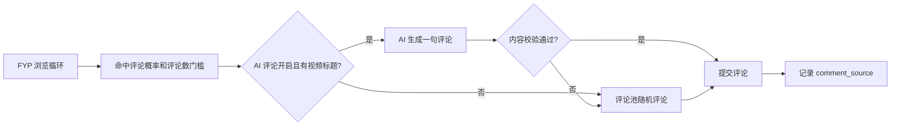
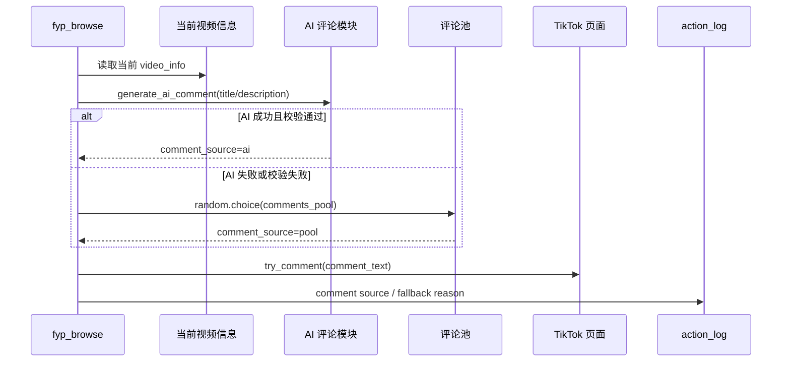

# TikTok AI 评论 V1 Design

## 总体设计

AI 评论是评论池的增强来源，而不是替代评论池。FYP 评论动作仍由原来的评论概率、评论目标数、评论数门槛控制；只有当本轮已经决定要评论时，才选择评论文本来源。



## 核心原则

- **默认关闭**：旧用户不配置也不受影响。
- **AI 只做文本来源**：不改变评论概率、浏览节奏和评论门槛。
- **短超时回退**：模型慢或失败时快速回到评论池。
- **最小上下文**：只把标题/描述等必要文本传给模型。
- **密钥安全**：API Key 不进入 `accounts.yaml`、评论文件或普通日志。
- **Provider 可替换**：Kimi Moonshot 是默认接入方，但 FYP 评论流程不绑定具体模型厂商。

## 配置模型

### 普通配置

建议在系统配置或平台配置中保存非敏感字段：

```yaml
ai_comment:
  enabled: false
  provider: kimi_moonshot
  base_url: https://api.moonshot.cn/v1
  model: kimi-k2.6
  timeout_seconds: 5
  max_comment_length: 80
  fallback_to_pool: true
  language: auto
  blocked_words: []
```

### 密钥配置

API Key 使用本机安全凭据存储。推荐 key：

```text
ai_comment.kimi_moonshot.api_key
```

桌面端只在保存、删除、测试连接、运行任务时读取密钥，不把密钥写入 YAML。

兼容迁移命名：

- V1 默认使用 `ai_comment.kimi_moonshot.api_key`。
- 如果代码里需要保留通用 Provider 抽象，`openai_compatible` 只能作为底层协议实现名，不作为默认 UI 文案。

## 模块设计

### Runtime 模块

新增模块：

```text
src/ai_comment.py
```

职责：

- 读取 AI 评论配置。
- 读取 API Key。
- 构造 Kimi Moonshot Chat Completions 请求。
- 解析模型输出。
- 校验评论内容。
- 返回评论生成结果。

推荐接口：

```text
generate_ai_comment(context, config, credential_reader) -> AiCommentResult
validate_generated_comment(text, config) -> ValidationResult
```

返回结构：

```json
{
  "ok": true,
  "comment": "这段内容很有意思",
  "source": "ai",
  "reason": "generated",
  "latency_ms": 820
}
```

失败结构：

```json
{
  "ok": false,
  "comment": "",
  "source": "ai",
  "reason": "timeout",
  "error": "request timed out"
}
```

### Desktop/Tauri 命令

建议新增命令：

```text
load_ai_comment_settings
save_ai_comment_settings
save_ai_comment_api_key
delete_ai_comment_api_key
get_ai_comment_api_key_status
test_ai_comment_connection
preview_ai_comment
```

说明：

- `save_ai_comment_settings` 只保存非敏感配置。
- `save_ai_comment_api_key` 使用本机安全凭据存储。
- `test_ai_comment_connection` 发送最小测试请求。
- `preview_ai_comment` 使用用户输入的示例标题生成一条评论，用于 UI 验证。

## Kimi Moonshot 请求

请求 URL：

```text
POST {base_url}/chat/completions
```

如果用户填写的 `base_url` 已包含 `/chat/completions`，实现应兼容处理，避免拼接重复。

默认配置：

```text
provider: kimi_moonshot
base_url: https://api.moonshot.cn/v1
model: kimi-k2.6
api_key_header: Authorization: Bearer <MOONSHOT_API_KEY>
```

说明：Kimi Moonshot API 兼容 OpenAI Chat Completions 请求/响应格式，所以实现可以复用 OpenAI-compatible HTTP 适配器，但 UI、配置默认值、日志和任务文档应以 `Kimi Moonshot` 命名。

## Provider Adapter 设计

AI 评论模块应拆成业务入口和模型适配器两层：

```text
fyp_browse
  -> generate_ai_comment(context, config, credential_reader)
      -> get_provider_adapter(config.provider)
          -> adapter.generate(context, config, api_key)
      -> validate_generated_comment(...)
```

默认 adapter：

```text
provider: kimi_moonshot
protocol: chat_completions
base_url: https://api.moonshot.cn/v1
auth: Authorization Bearer
response_path: choices[0].message.content
```

扩展规则：

- `kimi_moonshot` 使用 Chat Completions 兼容适配器。
- 其他兼容 Chat Completions 的模型供应商可以复用同一个 HTTP adapter，只替换 `base_url`、`model`、credential key 和 UI 默认值。
- 非兼容协议的供应商必须新增独立 adapter，但保持 `generate_ai_comment` 返回结构不变。
- 内容校验、评论池 fallback、评论概率和 FYP 浏览流程不得依赖具体 provider。
- 发布后新增兼容 Chat Completions 的 API 通常只需修改配置；新增非兼容 API 时只新增 adapter，不改评论池 fallback、内容校验和 FYP 评论决策逻辑。

推荐内部接口：

```text
ProviderAdapter.generate(context, config, api_key) -> RawModelResult
get_provider_adapter(provider) -> ProviderAdapter
```

推荐 provider 命名：

```text
kimi_moonshot
openai_compatible_custom
```

V1 UI 默认只暴露 `Kimi Moonshot`。如果要支持用户自定义兼容接口，可以在高级模式中开放 `openai_compatible_custom`，但不是 V1 必需项。

请求体：

```json
{
  "model": "kimi-k2.6",
  "messages": [
    {
      "role": "system",
      "content": "你只输出一句适合 TikTok 视频的自然短评论，不要解释，不要换行，不要包含链接、@或联系方式。"
    },
    {
      "role": "user",
      "content": "视频标题：...\n视频描述：...\n要求：80字以内，自然、友好、不要营销。"
    }
  ],
  "temperature": 0.7,
  "max_tokens": 80
}
```

响应解析：

```text
choices[0].message.content
```

## 评论生成流程



## FYP 接入设计

当前 `fyp_browse` 已能获得当前视频信息。阶段实现时应把每轮采集结果保存在当前循环变量中：

```text
current_video_info = capture_active_video_info(...)
```

评论文本选择逻辑：

```text
if ai_comment.enabled and has_title_or_description(current_video_info):
    generated = generate_ai_comment(current_video_info, ai_comment_config)
    if generated.ok:
        text = generated.comment
        source = "ai"
    else:
        text = random_pool_comment()
        source = "pool"
else:
    text = random_pool_comment()
    source = "pool"
```

注意：

- `comments_target`、`comment_prob`、`comment_min_videos` 不变。
- AI 生成只发生在已经命中评论动作后。
- 如果评论池为空且 AI 失败，则本次评论失败或跳过，沿用现有逻辑。

## 内容校验

基础校验函数：

```text
validate_generated_comment(text, max_length, blocked_words)
```

规则：

- 去除首尾空白。
- 合并多余空白。
- 不允许换行。
- 不允许 `http://`、`https://`、`www.`。
- 不允许 `@`。
- 不允许手机号、邮箱、WhatsApp/Telegram 等联系方式。
- 不允许超过 `max_comment_length`。
- 不允许命中 `blocked_words`。
- 不允许模型常见解释前缀，例如 `Here is`、`当然可以`、`评论：`。

校验失败返回原因：

```text
empty
multiline
url
mention
contact
too_long
blocked_word
prefixed_explanation
```

## UI 设计

页面：评论素材页。

新增区域：`AI 评论`，建议放在评论池编辑器下方或右侧高级设置区。

字段：

```text
启用 AI 评论：Switch
Provider：Kimi Moonshot
Base URL：Input
Model：Input
API Key：Password Input
超时秒数：InputNumber
最大评论长度：InputNumber
语言：Select(auto / 中文 / English / local)
敏感词黑名单：Textarea
```

操作：

```text
保存配置
保存 API Key
删除 API Key
测试连接
试生成
```

试生成输入：

```text
示例视频标题
示例视频描述
```

试生成输出：

```text
生成评论
校验结果
耗时
```

状态提示：

- 未配置 API Key：`未配置 API Key，开启后仍会回退评论池。`
- 测试成功：`AI 评论连接正常。`
- 测试失败：展示脱敏错误。

## 日志与记录

建议在 `action_log` 中新增轻量记录：

```text
action=comment_ai
status=ok
detail=source=ai latency_ms=820
```

失败时：

```text
action=comment_ai
status=fail
detail=reason=timeout fallback=pool
```

实际评论成功仍沿用原 `comment ok count=N` 汇总，避免破坏统计。

## 兼容策略

- 旧配置没有 `ai_comment`：按关闭处理。
- API Key 缺失：按关闭或失败回退处理。
- AI 生成失败：回退评论池。
- 评论池为空且 AI 失败：沿用现有跳过/失败行为。
- 不修改现有评论池文件格式。

## 安全策略

- API Key 只存在本机安全凭据存储。
- 请求日志不打印 API Key。
- 错误信息进入 `action_log` 前必须脱敏。
- 不向模型传递账号 ID、用户名、代理、Cookie、Token。
- 支持用户一键关闭 AI 评论。

## 验证重点

- AI 评论关闭时，原评论池逻辑完全不变。
- AI 评论开启且配置有效时，能生成并提交评论。
- AI 评论超时或失败时，能回退评论池。
- 生成内容不合规时不会发布。
- API Key 不出现在 YAML、日志和支持包敏感信息中。
- 评论素材页面原有编辑、保存、去重功能不回退。
