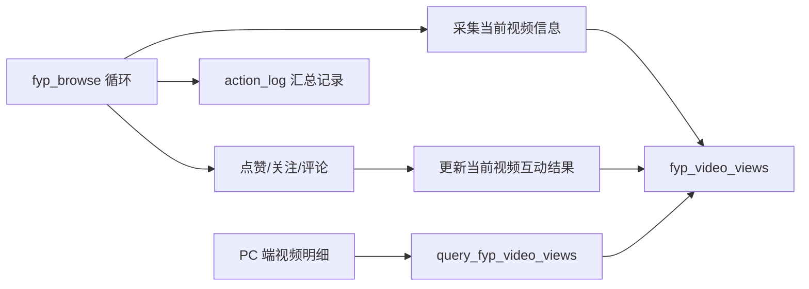
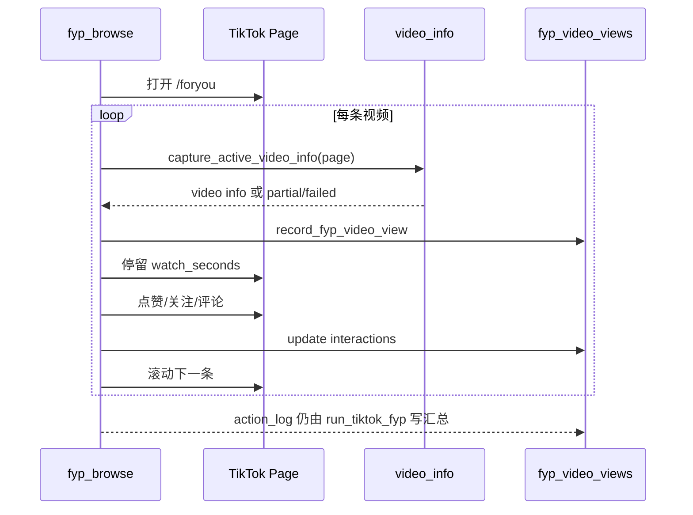

# TikTok FYP 视频信息采集 V1 Design

## 总体设计

新增能力采用旁路采集设计：FYP 浏览主流程保持现状，在每条视频停留期间 best-effort 读取当前可见视频信息，并写入独立明细表。现有 `action_log` 继续作为会话级汇总和统计来源。



## 核心原则

- **旁路写入**：视频明细表写入失败不能影响 `fyp_browse`。
- **短超时**：DOM 查询和解析必须控制在毫秒级到 1 秒内。
- **部分成功**：标题、作者、链接任一字段失败都不阻塞其他字段。
- **不改统计来源**：现有统计继续从 `action_log.detail` 解析 `videos/count`。
- **渐进增强**：先支持 TikTok FYP，后续其他平台可复用数据模型。

## 数据模型

### 新表：fyp_video_views

建议在 `src/core/runtime.py:init_db()` 中创建。

```sql
CREATE TABLE IF NOT EXISTS fyp_video_views (
    id INTEGER PRIMARY KEY AUTOINCREMENT,
    platform TEXT NOT NULL,
    account_id TEXT NOT NULL,
    session_id TEXT NOT NULL,
    video_index INTEGER NOT NULL,
    video_id TEXT,
    video_url TEXT,
    author_handle TEXT,
    author_name TEXT,
    title TEXT,
    description TEXT,
    watch_seconds REAL,
    liked INTEGER DEFAULT 0,
    followed INTEGER DEFAULT 0,
    commented INTEGER DEFAULT 0,
    capture_status TEXT NOT NULL,
    capture_error TEXT,
    raw_source TEXT,
    collected_at TEXT NOT NULL,
    updated_at TEXT NOT NULL,
    UNIQUE(platform, account_id, session_id, video_index)
);
```

索引：

```sql
CREATE INDEX IF NOT EXISTS idx_fyp_video_views_account_ts
ON fyp_video_views(platform, account_id, collected_at);

CREATE INDEX IF NOT EXISTS idx_fyp_video_views_video_id
ON fyp_video_views(platform, video_id);
```

### 字段说明

```text
session_id       单次 FYP 浏览会话 ID，进入 fyp_browse 时生成。
video_index      本次会话内第几条视频，从 1 开始。
video_id         尽量从 URL 或 DOM 链接提取。
video_url        普通 TikTok video 页面 URL。
title            优先展示标题，通常可等价使用 caption 主文本。
description      较长描述文本，作为 title fallback。
raw_source       字段来源，如 dom_caption、meta_og、url_only、failed。
capture_status   ok / partial / failed / disabled。
capture_error    脱敏后的错误摘要。
```

## Runtime API

在 `src/core/runtime.py` 新增函数：

```text
record_fyp_video_view(conn, platform, account_id, record)
update_fyp_video_interactions(conn, platform, account_id, session_id, video_index, liked, followed, commented)
```

设计要求：

- 函数内部捕获 SQLite 写入错误并返回布尔结果或错误字符串。
- 所有文本写入前执行长度限制和 `redact_runtime_text`。
- 不抛出异常到 FYP 主循环。

## 采集器设计

在 `src/platforms/tiktok/actions.py` 或独立模块 `src/platforms/tiktok/video_info.py` 新增采集函数。

推荐接口：

```text
capture_active_video_info(page, max_title_length=300, max_description_length=600) -> dict
```

返回示例：

```json
{
  "video_id": "7390000000000000000",
  "video_url": "https://www.tiktok.com/@handle/video/7390000000000000000",
  "author_handle": "handle",
  "author_name": "Display Name",
  "title": "短标题或主 caption",
  "description": "完整描述文本",
  "raw_source": "dom_caption",
  "capture_status": "ok",
  "capture_error": ""
}
```

### 提取顺序

1. 当前 URL：解析 `/@handle/video/<id>`。
2. 当前可见视频附近的 `a[href*="/video/"]`。
3. 当前可见视频容器中的 caption/description 文本。
4. `meta[property="og:title"]`、`meta[property="og:description"]`。
5. `document.title` 作为低优先级 fallback，但必须过滤 TikTok 通用标题。

### 可见视频定位

沿用现有 `_find_active_button` 的思路，以 viewport 中心作为当前视频判断依据：

- 找到可见范围内最接近视口中心的视频容器。
- 在该容器中读取文本和链接。
- 如果无法定位容器，则从全页可见候选中取最接近中心的候选。

### 文本清洗

规则：

- 合并连续空白。
- 去除控制字符。
- 移除明显 UI 文案，如 `Follow`、`Like`、`Comment`、`Share`。
- 限制 `title` 和 `description` 最大长度。
- 空字符串按 `None` 保存。

## FYP 主流程改造

`fyp_browse` 当前返回汇总 dict。建议扩展参数，但保持默认兼容。

新增参数：

```text
conn=None
platform="tiktok"
account_id=None
capture_video_info=True
video_capture_config=None
```

流程：



兼容策略：

- `conn` 或 `account_id` 为空时，跳过 DB 明细写入，只保留原行为。
- `capture_video_info=False` 时完全跳过 DOM 采集。
- `fyp_browse` 返回结构可新增 `video_capture` 汇总字段，但现有字段必须保留。

## 配置设计

扩展 TikTok warmup 配置：

```yaml
tiktok:
  warmup:
    video_capture:
      enabled: true
      max_title_length: 300
      max_description_length: 600
      capture_timeout_ms: 800
```

默认值：

```text
enabled=true
max_title_length=300
max_description_length=600
capture_timeout_ms=800
```

关闭时：

- 不调用 `capture_active_video_info`。
- 不写入 `fyp_video_views`。
- 原 FYP 汇总继续正常记录。

## Tauri 查询接口

在 `desktop/src-tauri/src/commands/stats.rs` 新增：

```text
FypVideoViewFilter
FypVideoViewRecord
query_fyp_video_views(filter) -> Vec<FypVideoViewRecord>
```

筛选字段：

```text
platform
account_id
start_ts
end_ts
has_title
liked
commented
limit
```

返回字段：

```text
id
platform
accountId
sessionId
videoIndex
videoId
videoUrl
authorHandle
authorName
title
description
watchSeconds
liked
followed
commented
captureStatus
captureError
rawSource
collectedAt
updatedAt
```

查询规则：

- 默认 `limit=300`，最大 `1000`。
- 按 `collected_at DESC, id DESC` 排序。
- 表不存在时返回空数组。
- `capture_error` 返回前执行脱敏。

## 前端设计

### 类型与服务

在 `desktop/src/services/types.ts` 新增：

```text
FypVideoViewRecord
FypVideoViewFilter
```

在 `desktop/src/services/api.ts` 新增：

```text
queryFypVideoViews(filter: FypVideoViewFilter)
```

### UI 入口

推荐第一版放在【执行记录】页面新增 Tab：

```text
动作记录
FYP 视频明细
目标互动
目标关注
```

原因：

- 视频明细属于任务执行证据。
- 与现有筛选条件、SQLite 状态、数据源说明可以复用。
- 不改变统计页现有聚合逻辑。

### 表格列

```text
时间
账号
序号
作者
标题/描述
video_id
观看秒数
点赞
关注
评论
采集状态
操作
```

操作：

- 复制标题。
- 复制视频链接。
- 可选：打开视频链接。

空态：

```text
尚未生成 FYP 视频明细。首次运行开启视频信息采集后的养号任务后会生成记录。
```

## 错误处理

采集错误：

- 记录 `capture_status=failed`。
- `capture_error` 保存短错误摘要。
- 不中断本轮浏览。

写库错误：

- 打印一次脱敏诊断日志。
- 不影响 `action_log`。
- 不影响最终 `videos=N` 汇总。

查询错误：

- 表不存在返回空数组。
- SQLite 打开失败沿用现有错误提示。

## 迁移策略

- `init_db()` 创建新表和索引。
- 不修改旧表列。
- 旧数据不会自动补标题。
- 新功能上线后新运行的任务才产生明细。

## 验证重点

- FYP 浏览原有动作汇总不变。
- 新表自动创建。
- 运行一轮 FYP 后可查到视频明细。
- 标题采集失败时仍有 `video_index` 和 `capture_status`。
- 点赞成功时对应明细 `liked=true`。
- 关闭配置后不产生新明细。
- 执行记录页面旧 Tab 和统计页结果不回退。
